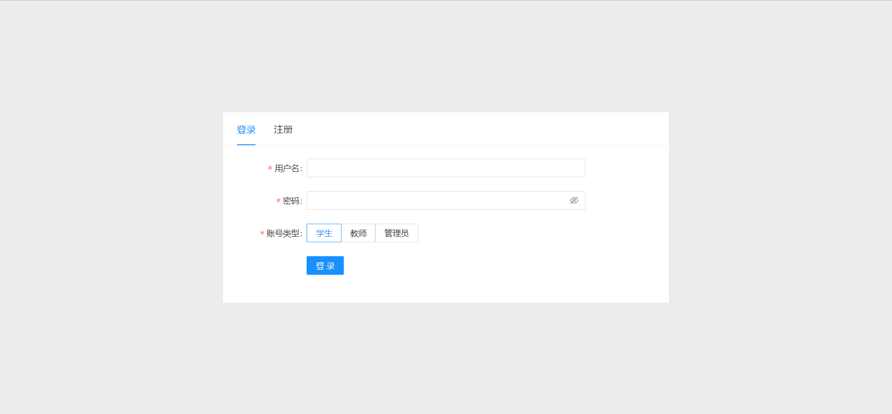
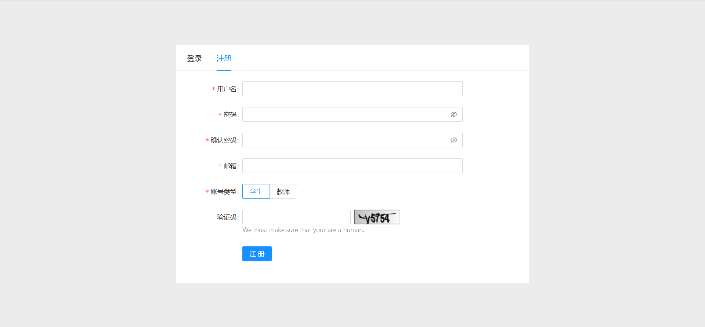
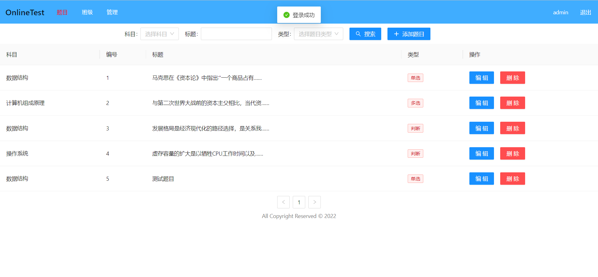
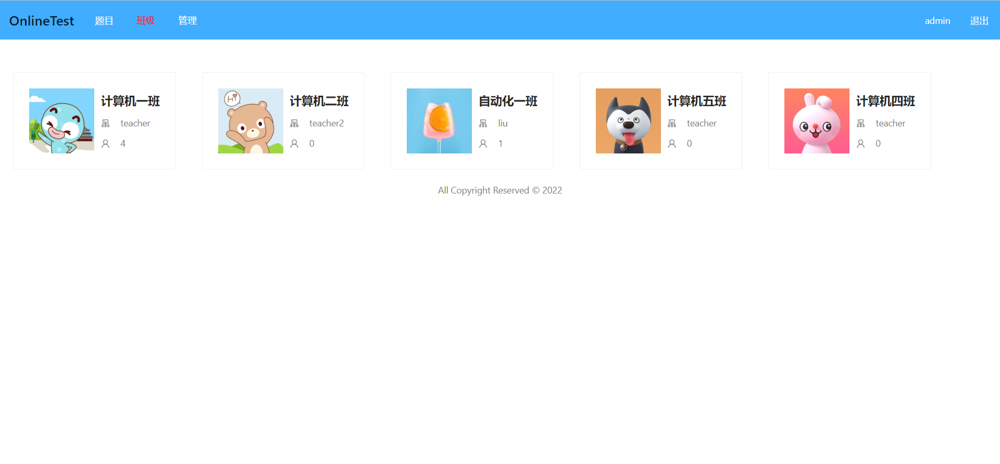
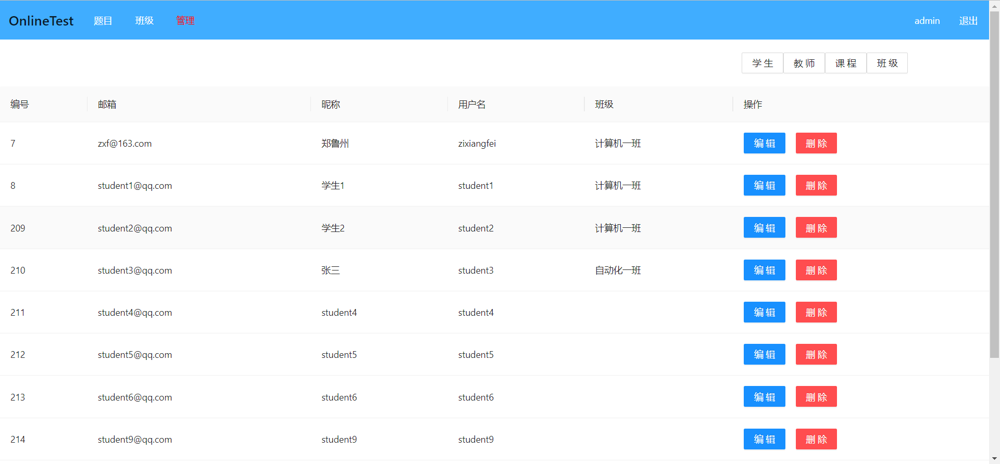
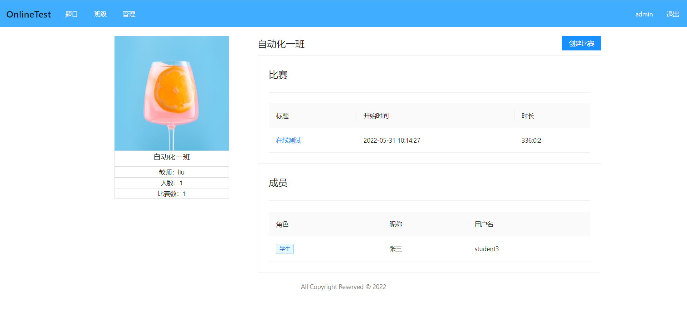
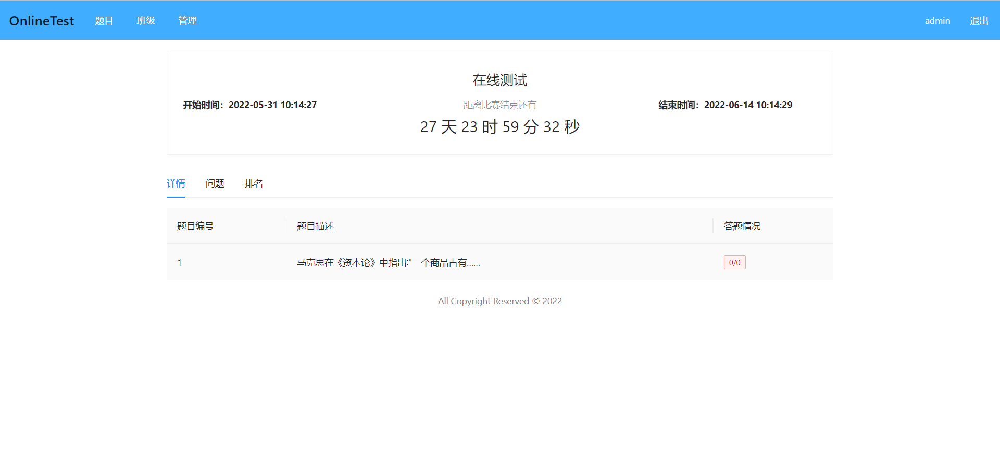

# 基于React的在线测验系统

## ✨项目介绍

基于React实现的在线测验系统

后端接口：[https://github.com/zixiangfei/OnlineTest](https://github.com/zixiangfei/OnlineTest)

目前实现的功能如下：

- [x] 登录和注册
- [x] 创建测验
- [x] 学生答题
- [ ] 题目的创建、修改和删除
- [ ] 学生信息的修改和删除
- [ ] 教师信息的修改和删除

## 👀效果展示

## 🤝 欢迎贡献

对于一些 Bug 修复和细节优化，欢迎直接提交 PR 🌹

## 🧾License

Distributed under the MIT License. See `LICENSE` for more information.
